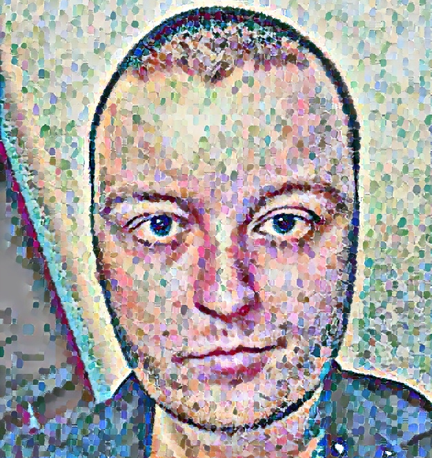

# Meta Corner



Welcome to my (very temporary) portfolio!

## Description

This is my (VERY VERY TEMPORARY) portfolio website, showcasing my previous projects

It contains:

The three major assignment projects from the first year at Noroff
- Gamehub (A website where people can buy video games)
- Meta Corner (A blog website)
- Community Science Museum (A website for a community driven science museum)


## Built With

This project was build using:

- HTML 5
- CSS


## Getting Started

### Installing

1. Clone the repo:

```bash
git https://github.com/Olekrr/Portfolio
```


## Contributing

This is a personal (VERY VERY VERY VERY VERY TEMPORARY) portfolio page, and as such is not open for contributions.

## Contact

To get in contact with me, please use one of the below options:

- Email: olekrrasmussen@gmail.com
- Discord: "Ole Kristian#5413"

## Acknowledgments

[Noroff](https://www.noroff.no/en)